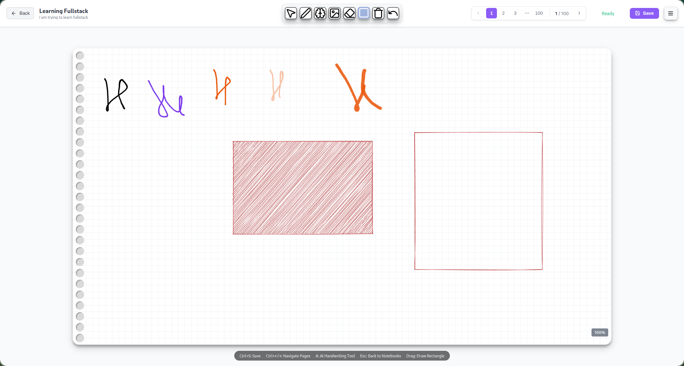

# Inkdraw

A professional digital notebook application designed for seamless drawing and note-taking experiences. Built with React and Electron for cross-platform compatibility.

## Screenshots

<!-- Add application screenshots or demo video here -->



## Features

- **Smooth Drawing Canvas**: High-performance drawing with smooth pen input
- **Multiple Tools**: Pen, shapes, and AI-powered text tools
- **Notebook Management**: Create, organize, and navigate between multiple notebooks
- **Page Navigation**: Multi-page support with easy page management
- **Cross-Platform**: Available for Windows, macOS, and Linux

## Requirements

- Node.js 16 or higher
- Yarn package manager

## Installation

```bash
# Clone the repository
git clone <repository-url>
cd inkDraw

# Install dependencies
yarn install
```

## Development

```bash
# Start development server
yarn start

# Run with Electron (development)
yarn electron-dev

# Run tests
yarn test
```

## Building

```bash
# Build for production
yarn build

# Package Electron app
yarn electron-pack

# Package for specific platforms
yarn electron-pack:win    # Windows
```

## Architecture

- **Frontend**: React with Zustand for state management
- **Desktop**: Electron for cross-platform desktop application
- **Styling**: SCSS modules for component styling
- **Drawing**: Custom canvas engine with smooth rendering

## Author

Captain Electron

## License

Private
